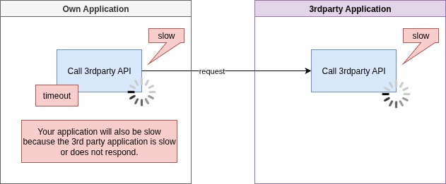
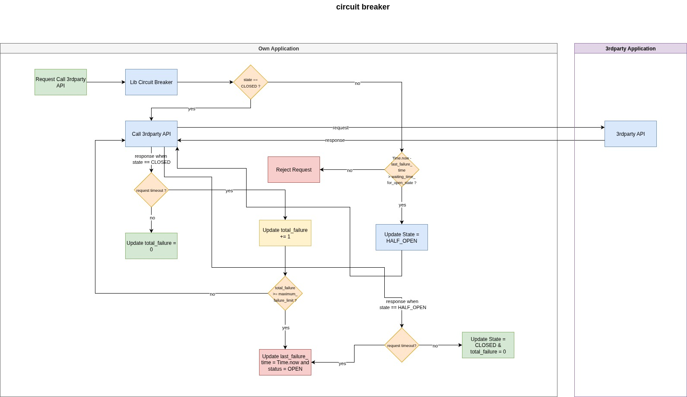

# Cutter

Cutter is a Ruby library that implements the circuit breaker design pattern, so your application will be more stable even if your 3rd party application is having problems.

## High Flow

Potential problems when 3rdparty applications experience problems : 



Circuit breaker solution to prevent system failure due to problematic 3rdparty applications :



## Requirement

Minimum software version that must be installed on your device :
- ruby 3.0

Requires dependencies to the following gems :
- httparty

## Installation

Add this line to your application's Gemfile :

```ruby
# Gemfile
gem 'cutter', git: 'git@github.com:solehudinmq/cutter.git', branch: 'main'
```

Open terminal, and run this : 

```bash
cd your_ruby_application
bundle install
```

## Usage

In your ruby ​​code, add this:

```ruby
require 'cutter'

cb = ::Cutter::CircuitBreaker.new(failure_threshold: <your-failure-threshold>, waiting_time: <your-waiting-time>)

result = cb.perform(url: <your-url>, http_method: <your-http-method>, headers: <your-request-headers>, body: <your-request-body>, timeout: <your-timeout-limit-calling-destination-api>)

# how to call response code : 
result.code
# how to call response body :
result.body
# how to call response headers :
result.headers
```

description of parameters:
- failure_threshold : maximum allowable failure, for example : 3.
- waiting_time : waiting time in seconds for state open to become state half open, for example : 5.
- url : destination api url, for example : 'https://dummyjson.com/products/1'.
- http_method : the type of http method used to call the target api, for example : :GET / :POST / :PUT / :PATCH / :DELETE.
- headers : request headers, for example : { 'Content-Type': 'application/json' }.
- body : request body, for example : { title: "Produk Dummy Title 1", description: "Produk Dummy Description 1" }.
- timeout : maximum timeout limit in seconds when calling the target api, for example : 10.

For more details, you can see the following example : [example/app.rb](./example/app.rb).

## Example Implementation in Your Application

For examples of applications that use this gem, you can see them here : [example](./example).

## Contributing

Bug reports and pull requests are welcome on GitHub at https://github.com/solehudinmq/cutter.

## License

The gem is available as open source under the terms of the [MIT License](https://opensource.org/licenses/MIT).
